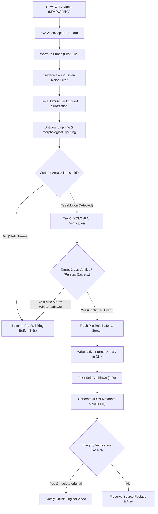

# SlimVision: AI-Powered Smart CCTV Video & Storage Optimization System

[](https://www.python.org/)
[](https://opencv.org/)
[](https://docs.ultralytics.com/)
[](https://github.com/)
[](LICENSE)

---

## 1. Executive Summary & Problem Statement

Standard Closed-Circuit Television (CCTV) systems record 24/7 continuous video streams. In most enterprise, commercial, and residential surveillance environments, **over 80% to 95% of recorded footage consists of static, empty scenes** with zero actionable activity.

### The Cost of Redundant Footage:
- **Excessive Storage Demands**: Exabytes of static footage fill on-premise NVR hard drives and inflate cloud storage bills.
- **Hardware Wear & Power Consumption**: Continuous, high-bitrate write cycles accelerate drive failure rates and increase server power consumption.
- **Investigation Inefficiencies**: Security analysts must spend hours manually scrubbing through hours of empty recordings to find key events.

### The SlimVision Solution:
SlimVision is an industrial-grade, two-tier video optimization pipeline. It combines **high-speed background subtraction (MOG2)** with **deep learning object verification (YOLOv8)** and **zero-OOM streaming ring buffers**. It automatically filters out empty frames, preserves smooth pre-event and post-event context, logs granular forensic metadata, and safely reduces video storage footprints by up to 90%.

---

## 2. System Architecture

SlimVision utilizes a hierarchical two-tier detection architecture designed for high throughput and low false-positive rates:



---

## 3. Key Features

- **100% Offline & Air-Gapped**: Runs entirely locally on your hardware. Zero cloud API calls, zero external server communication, and no internet required at runtime.
- **Hierarchical Two-Tier Detection**:
  - *Tier 1 (MOG2)*: Ultra-fast $O(1)$ pixel-level background subtraction discards static frames without GPU overhead.
  - *Tier 2 (YOLOv8)*: AI verification eliminates false triggers caused by swaying branches, moving clouds, shadows, and headlights.
- **Zero-OOM Streaming Ring Buffer**:
  - Eliminates in-memory frame accumulation crashes.
  - Preserves **Pre-Roll** (1.5s prior to trigger) and **Post-Roll** (2.0s after motion ceases) to ensure context is never clipped.
- **24/7 Continuous Watcher Daemon**:
  - Automatically monitors input folders for newly saved CCTV footage, processes files continuously, and sleeps between cycles.
- **Low-Spec Hardware Optimized**:
  - Runs on low-performance PCs, budget laptops, Intel Celerons, or Raspberry Pi 4/5.
- **Industrial Safe Deletion Protocol**:
  - Never deletes raw footage blindly.
  - Verifies container validity, frame count, byte size, and JSON log integrity before safely removing source files.
- **Universal Codec Negotiation**:
  - Automatically selects `avc1` (H.264) for web/mobile streaming playback, falling back to `mp4v` if needed.

---

## 4. Hardware & System Requirements

SlimVision is engineered to operate across a wide spectrum of hardware, from single-board edge computers to multi-channel surveillance servers:

### ⚙️ Minimum Hardware Specifications (Low-End / Edge Devices)
*Suitable for running in Lightweight CPU Mode (`--no-yolo`) or single camera stream with YOLO Nano:*
- **CPU**: Dual-core processor (Intel Celeron, Core i3 4th Gen+, AMD Ryzen 3, or ARM Cortex-A72 / Raspberry Pi 4/5)
- **RAM**: 2 GB RAM (SlimVision consumes only $\sim 250\text{ MB}$ RAM)
- **Storage**: 500 MB free disk space for application & model weights
- **OS**: Linux (Ubuntu 18.04+, Debian, CentOS, RPi OS), Windows 10/11, macOS 10.15+

### 🚀 Recommended Hardware Specifications (High-Throughput / Multi-Camera)
*Suitable for multi-stream batch processing and full YOLOv8 AI object verification:*
- **CPU**: Quad-core Intel Core i5/i7 (8th Gen+) or AMD Ryzen 5/7
- **RAM**: 8 GB RAM or higher
- **GPU (Optional)**: NVIDIA GPU with CUDA support (for instantaneous multi-stream deep learning)
- **Storage**: SSD for high-speed video read/write I/O

---

## 5. Installation & Setup

### Step 1: Clone Repository & Create Virtual Environment
```bash
# Clone the repository
git clone <YOUR_GITHUB_REPO_URL>
cd SlimVision

# Create and activate virtual environment
python3 -m venv venv
source venv/bin/activate  # On Windows: venv\Scripts\activate
```

### Step 2: Install Dependencies
```bash
pip install -r requirements.txt
```

---

## 6. Usage & CLI Command Reference

### Basic Run (Single Batch)
Process all existing videos in `cctv/` and output optimized videos to `processed/`:
```bash
python main.py
```

### Continuous 24/7 Watcher Daemon Mode
Runs in the background indefinitely, monitoring `cctv/` for new video drops:
```bash
python main.py --watch --poll-interval 5.0
```

### Low-Performance PC Mode (Fastest CPU Execution)
For older computers or low-power hardware, disable YOLO and use pure MOG2:
```bash
python main.py --no-yolo --watch
```

### Dry Run (Simulate Savings without Writing or Deleting)
```bash
python main.py -i cctv/ --dry-run
```

### Enable Verified Safe Deletion
```bash
python main.py -i cctv/ --delete-original --watch
```

### Custom AI Verification & Filtering
```bash
# Only record when persons, cars, or dogs are verified
python main.py -i cctv/ --confidence 0.40 --classes person,car,truck,dog
```

### Command-Line Arguments Table

| Argument | Default | Description |
| :--- | :--- | :--- |
| `-i`, `--input` | `cctv` | Path to video file or directory containing video files. |
| `-o`, `--output` | `processed` | Directory where optimized videos and logs will be saved. |
| `-w`, `--watch` | `False` | Enable continuous 24/7 folder watcher daemon mode. |
| `--poll-interval` | `5.0` | Polling frequency (seconds) in 24/7 watch mode. |
| `--model` | `yolov8n.pt` | Path to local YOLOv8 weights file. |
| `--no-yolo` | `False` | Disable YOLOv8 and operate in lightweight MOG2 motion mode. |
| `--confidence` | `0.35` | Minimum detection confidence threshold for YOLOv8. |
| `--classes` | `person,car...` | Comma-separated list of target object classes to record. |
| `--min-area` | `1000` | Minimum contour area (pixels) to qualify as Tier-1 motion. |
| `--pre-roll` | `1.5` | Seconds of footage captured before motion trigger. |
| `--post-roll` | `2.0` | Seconds of footage captured after motion ceases. |
| `--delete-original` | `False` | Safely remove original video after integrity verification. |
| `--dry-run` | `False` | Analyze footage and output metrics without file deletion. |
| `--log-level` | `INFO` | Logging level (`DEBUG`, `INFO`, `WARNING`, `ERROR`). |

---

## 7. Options for Running 24/7 in the Background

### Option A: Linux `nohup` (Simplest Background Execution)
Run SlimVision in the background detached from the terminal session:
```bash
# Start background execution with logging
nohup ./venv/bin/python main.py --watch --delete-original > slimvision.log 2>&1 &

# Monitor logs in real-time
tail -f slimvision.log

# Check running process
pgrep -fl "python main.py"

# Stop the background process
kill $(pgrep -f "python main.py")
```

---

### Option B: Linux `systemd` Service (Recommended for Enterprise / Production)
*Ensures automatic startup on computer reboot and automatic restart if interrupted.*

1. Create a service file:
   ```bash
   sudo nano /etc/systemd/system/slimvision.service
   ```
2. Paste the configuration (replace paths with your own):
   ```ini
   [Unit]
   Description=SlimVision 24/7 Smart CCTV Video Optimizer
   After=network.target

   [Service]
   Type=simple
   User=YOUR_USERNAME
   WorkingDirectory=/path/to/SlimVision
   ExecStart=/path/to/SlimVision/venv/bin/python main.py --watch --delete-original
   Restart=always
   RestartSec=5

   [Install]
   WantedBy=multi-user.target
   ```
3. Enable and start the service:
   ```bash
   sudo systemctl daemon-reload
   sudo systemctl enable slimvision
   sudo systemctl start slimvision
   ```
4. Service Management:
   ```bash
   # Check service status
   sudo systemctl status slimvision

   # View live systemd logs
   journalctl -u slimvision -f

   # Stop service
   sudo systemctl stop slimvision
   ```

---

### Option C: Terminal Multiplexer (`tmux` / `screen`)
Run inside an independent virtual terminal that stays alive even when you close SSH or your terminal window:
```bash
# Start a new tmux session
tmux new -s slimvision

# Inside tmux: activate venv and run
source venv/bin/activate
python main.py --watch --delete-original

# Detach from session: Press Ctrl+B, then press D
# (SlimVision will continue running in the background!)

# Re-attach to check anytime:
tmux attach -t slimvision
```

---

## 8. Output Format & JSON Metadata Schema

Each processed video produces:
1. **Optimized Video**: `<filename>_optimized.mp4` (containing only verified motion events with pre/post-roll).
2. **Metadata Log**: `<filename>_log.json` containing complete forensic timestamps and compression analytics.

### Sample JSON Output (`output_log.json`):
```json
{
    "source_file": "/workspace/cctv/cam01.mp4",
    "output_video": "/workspace/processed/cam01_optimized.mp4",
    "codec_used": "avc1",
    "metrics": {
        "original_frames": 9000,
        "compressed_frames": 1800,
        "original_duration_sec": 300.0,
        "compressed_duration_sec": 60.0,
        "temporal_reduction_percentage": 80.0,
        "original_file_size_mb": 75.4,
        "compressed_file_size_mb": 15.1,
        "storage_reduction_percentage": 79.97,
        "total_events_detected": 3,
        "processing_time_sec": 14.2,
        "processing_fps": 211.2,
        "realtime_factor": 7.04
    },
    "events": [
        {
            "event_id": 1,
            "start_seconds": 12.4,
            "end_seconds": 32.1,
            "duration_seconds": 19.7,
            "start_frame": 372,
            "end_frame": 963,
            "detected_objects": [
                {
                    "class": "person",
                    "max_confidence": 0.892
                },
                {
                    "class": "car",
                    "max_confidence": 0.764
                }
            ]
        }
    ]
}
```

---

## 9. Documentation Roadmap

For in-depth explanations, refer to the documentation files:
- 📖 **[`technical_details.md`](file:///home/sanal-sivakumar/Documents/SlimVision/technical_details.md)**: Deep pedagogical breakdown of every algorithm, math formula, computer vision concept, and architectural design decision.
- 🛠️ **[`troubleshoot.md`](file:///home/sanal-sivakumar/Documents/SlimVision/troubleshoot.md)**: Production error handbook covering common bugs, codec failures, edge-case mitigation, and performance tuning.

