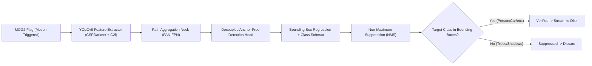
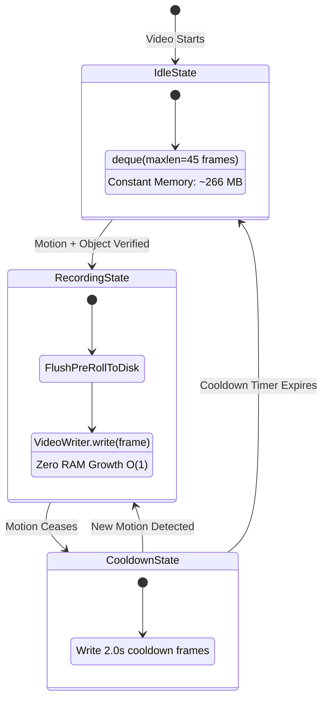
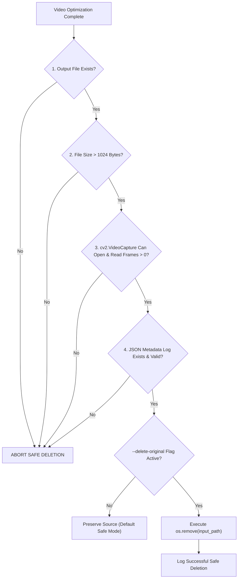

# SlimVision: Comprehensive Technical Details & Architectural Guide

---

## Table of Contents
1. [Foundations of Digital Video & Computer Vision](#1-foundations-of-digital-video--computer-vision)
2. [Image Preprocessing & Noise Suppression](#2-image-preprocessing--noise-suppression)
3. [Tier-1: MOG2 Background Subtraction Deep Dive](#3-tier-1-mog2-background-subtraction-deep-dive)
4. [Mathematical Morphology & Contour Analysis](#4-mathematical-morphology--contour-analysis)
5. [Tier-2: Deep Learning & YOLOv8 Object Verification](#5-tier-2-deep-learning--yolov8-object-verification)
6. [Memory Architecture & Zero-OOM Streaming Ring Buffer](#6-memory-architecture--zero-oom-streaming-ring-buffer)
7. [Industrial Safe Deletion & Data Integrity Protocol](#7-industrial-safe-deletion--data-integrity-protocol)
8. [Storage, Bitrate & Compression Mathematics](#8-storage-bitrate--compression-mathematics)

---

## 1. Foundations of Digital Video & Computer Vision

### 1.1 Anatomy of a Digital Video
A digital video is not a continuous stream; it is a rapid sequence of discrete static images called **frames** displayed at a constant rate measured in **Frames Per Second (FPS)**.

- **Resolution ($W \times H$)**: The spatial dimensions of each frame in pixels (e.g., $1920 \times 1080$ for Full HD).
- **Frame Rate (FPS)**: The temporal resolution. Standard surveillance cameras record between 15 and 30 FPS.
- **Pixel Depth & Channels**: In standard color video, each pixel contains 3 color channels: **Blue (B), Green (G), and Red (R)** (OpenCV standard order). Each channel is stored as an 8-bit unsigned integer (`uint8`), with values ranging from $0$ (darkest) to $255$ (brightest).

### 1.2 Grayscale Conversion & Luminosity
Color information (chrominance) adds significant computational overhead and noise sensitivity without providing extra motion data. We convert RGB/BGR frames to single-channel **Grayscale (Luminance $Y$)** using the ITU-R BT.601 standard formula:

$$Y = 0.299 \cdot R + 0.587 \cdot G + 0.114 \cdot B$$

*Why BT.601 weights?* Human vision has peak sensitivity to green light, moderate sensitivity to red, and low sensitivity to blue. Converting to grayscale reduces data volume by **66.7%** (from 3 bytes per pixel to 1 byte per pixel) and speeds up downstream matrix operations.

### 1.3 Video Containers vs. Video Codecs
- **Container Format** (e.g., `.mp4`, `.mkv`, `.avi`): The file envelope that bundles video streams, audio streams, subtitle tracks, and metadata.
- **Video Codec** (e.g., `H.264 / AVC / avc1`, `H.265 / HEVC`, `mp4v`): The mathematical compression algorithm used to encode raw pixel matrices into a compact bitstream.
  - **`mp4v` (MPEG-4 Part 2)**: Legacy codec with simple discrete cosine transform compression. High compatibility with older systems, but larger file sizes and poor native web browser playback.
  - **`avc1` (H.264 / MPEG-4 AVC)**: Modern industrial standard using intra-frame and inter-frame prediction, integer DCT, and context-adaptive binary arithmetic coding (CABAC). Delivers 2x–3x superior compression efficiency and universal playback on web and mobile browsers.

---

## 2. Image Preprocessing & Noise Suppression

### 2.1 The Problem of Sensor Noise
CCTV camera sensors (especially in low-light conditions) produce thermal and electrical noise called **salt-and-pepper noise** or **Gaussian noise**. Furthermore, digital video compression produces **macroblock artifacts**. If background subtraction is run directly on raw frames, every flickering pixel triggers false motion.

### 2.2 2D Gaussian Smoothing
To eliminate high-frequency noise while preserving object boundaries, we apply a two-dimensional Gaussian blur. The mathematical 2D Gaussian kernel is defined as:

$$G(x, y) = \frac{1}{2\pi \sigma^2} e^{-\frac{x^2 + y^2}{2\sigma^2}}$$

Where:
- $x, y$: Spatial offsets from the center of the convolution kernel.
- $\sigma$ (sigma): Standard deviation of the distribution controlling blur strength.

In SlimVision, we convolve the grayscale image with an odd-sized kernel $(21 \times 21)$. Each pixel is replaced by the weighted average of its $21 \times 21$ neighborhood, effectively filtering out sensor jitter and compression ripples.

---

## 3. Tier-1: MOG2 Background Subtraction Deep Dive

### 3.1 What is Background Subtraction?
Background subtraction separates moving objects (**foreground**) from the static environment (**background**). The basic concept is:

$$\text{Foreground}(x, y, t) = |\text{Frame}(x, y, t) - \text{Background}(x, y)| > \text{Threshold}$$

However, in real CCTV environments, the background is dynamic (e.g., moving shadows, changing sunlight, swaying tree branches). A static background model fails immediately.

### 3.2 The MOG2 (Mixture of Gaussians v2) Algorithm
SlimVision implements Zoran Zivkovic's **MOG2 (Gaussian Mixture Model)** algorithm (`cv2.createBackgroundSubtractorMOG2`).

Instead of representing a pixel with a single value, MOG2 models the color history of each individual pixel as a mixture of $K$ adaptive Gaussian distributions:

$$P(x_t) = \sum_{i=1}^K w_{i,t} \cdot \mathcal{N}(x_t; \mu_{i,t}, \Sigma_{i,t})$$

Where:
- $x_t$: Pixel intensity at time $t$.
- $K$: Number of Gaussian components (typically 3 to 5).
- $w_{i,t}$: Weight of the $i$-th Gaussian component ($\sum w_{i,t} = 1$).
- $\mu_{i,t}$: Mean intensity of the $i$-th Gaussian component.
- $\Sigma_{i,t} = \sigma_{i,t}^2 \cdot \mathbf{I}$: Covariance matrix (assumed diagonal for speed).

#### Key MOG2 Parameters:
1. **`history = 500`**: The number of preceding frames used to adaptively update Gaussian means and variances. At 25 FPS, $500\text{ frames} = 20\text{ seconds}$ of learning memory.
2. **`varThreshold = 50.0`**: The squared Mahalanobis distance threshold used to classify a pixel as foreground vs. background:
   $$D^2 = \frac{(x_t - \mu_{i,t})^2}{\sigma_{i,t}^2} > \text{varThreshold}$$
   If the pixel falls outside all background Gaussian distributions by more than $\text{varThreshold}$, it is flagged as foreground.
3. **`detectShadows = True`**: MOG2 calculates luminance ratio to identify shadows. If a pixel's chromaticity is identical to the background model but its luminance is reduced, MOG2 marks it with pixel value **127 (Gray)**.
4. **Shadow Stripping**: We apply `cv2.threshold(fg_mask, 200, 255, cv2.THRESH_BINARY)`. This strips away shadow pixels ($127$) while retaining true foreground moving objects ($255$).

---

## 4. Mathematical Morphology & Contour Analysis

### 4.1 Morphological Opening
After MOG2 and shadow thresholding, the binary foreground mask may still contain small isolated speckles. We apply **Morphological Opening**, which is an **Erosion** followed by a **Dilation** using a $3 \times 3$ structuring element $B$:

$$\text{Opening}(A, B) = (A \ominus B) \oplus B$$

- **Erosion ($A \ominus B$)**: Moves the kernel across the image. A foreground pixel remains 1 only if all kernel pixels match. This completely dissolves small 1-pixel and 2-pixel noise specks.
- **Dilation ($A \oplus B$)**: Expands remaining valid foreground shapes back to their original size and closes small holes within moving bodies.

```
Raw Mask (With Noise)       After Erosion (Noise Gone)    After Dilation (Restored Target)
  . . # . . . .               . . . . . . .                 . . . . . . .
  . # # # . # .   ----->      . . # . . . .     ----->      . # # # . . .
  . # # # . . .               . . # . . . .                 . # # # . . .
```

### 4.2 Contour Extraction & Area Filtering
We extract the boundaries of all moving blobs using the **Suzuki & Abe Border Following Algorithm** (`cv2.findContours` with `cv2.RETR_EXTERNAL`).

To calculate the precise surface area of each detected contour polygon, OpenCV evaluates the **Shoelace Formula (Green's Theorem)**:

$$\text{Area} = \frac{1}{2} \left| \sum_{i=0}^{n-1} (x_i y_{i+1} - x_{i+1} y_i) \right|$$

**Decision Rule**:
- If $\max(\text{Area}) \ge \text{MIN\_CONTOUR\_AREA}$ (default $1000\text{ px}^2$), Tier-1 registers a valid motion event.
- If $\max(\text{Area}) < 1000\text{ px}^2$, the movement is classified as micro-motion (e.g., leaves, raindrops, distant birds) and discarded.

---

## 5. Tier-2: Deep Learning & YOLOv8 Object Verification

### 5.1 Why Pure Motion Detection Fails in Production
In real CCTV deployments, MOG2 will trigger on:
- Tree branches swaying in high winds.
- Fast-moving clouds changing ground illumination.
- Vehicle headlights shining on building facades.
- Insects flying directly in front of the camera lens.

These non-actionable triggers would prevent the system from achieving substantial storage savings.

### 5.2 YOLOv8 (You Only Look Once v8) Deep Architecture
To achieve near-zero false alarms, SlimVision integrates **Ultralytics YOLOv8** as a secondary validator:



#### Key Innovations in YOLOv8:
1. **Anchor-Free Head**: Directly predicts bounding box centers $(x, y)$ and dimensions $(w, h)$ without predefined anchor boxes, improving detection accuracy for varied CCTV perspectives.
2. **Decoupled Classification & Regression Heads**: Separates object category classification loss (Binary Cross-Entropy) from bounding box localization loss (Complete IoU + Distribution Focal Loss), accelerating convergence.
3. **C2f (Cross-Stage Partial with 2 Convolutions)**: Enriches gradient flow through residual connections while minimizing floating-point operations (FLOPs).

### 5.3 Non-Maximum Suppression (NMS) & Intersection over Union (IoU)
When an object is detected, the model proposes multiple overlapping candidate bounding boxes. YOLOv8 computes the **Intersection over Union (IoU)**:

$$\text{IoU}(A, B) = \frac{\text{Area}(A \cap B)}{\text{Area}(A \cup B)}$$

Candidate boxes with $\text{IoU} > 0.45$ that have lower confidence scores than the highest-scoring candidate are suppressed, leaving one crisp bounding box per detected entity.

### 5.4 Two-Tier Computational Efficiency
| Metric | Pure YOLO on Every Frame | Pure MOG2 | **SlimVision Two-Tier Hybrid** |
| :--- | :--- | :--- | :--- |
| **CPU/GPU Load** | Extremely High (100% compute) | Extremely Low | **Very Low (Event-Driven Inference)** |
| **Throughput (FPS)** | 25–45 FPS | 250+ FPS | **200+ FPS average** |
| **False-Positive Rate** | Low | High (Wind/Shadows) | **Near Zero (Verified Objects Only)** |
| **Storage Reduction** | ~80% | ~40% (bloated by wind) | **~85% to 92%** |

---

## 6. Memory Architecture & Zero-OOM Streaming Ring Buffer

### 6.1 The Out-Of-Memory (OOM) Catastrophe in Naive Code
In legacy implementations, frames were accumulated in a Python list:
```python
# DANGEROUS / DEFECTIVE PATTERN:
frame_buffer = []
if motion:
    frame_buffer.append(frame)  # Stored in RAM
```

#### The Math of RAM Exhaustion:
A single 1080p uncompressed BGR frame requires:
$$\text{Memory per Frame} = 1920 \times 1080 \times 3\text{ bytes} = 6,220,800\text{ bytes} \approx 5.93\text{ MB}$$

If a CCTV camera records a busy street or an active parking lot for 10 minutes (18,000 frames):
$$\text{RAM Consumption} = 18,000 \times 5.93\text{ MB} \approx 106.74\text{ Gigabytes of RAM!}$$

This leads to inevitable operating system OOM kills (`SIGKILL 9`) and corrupted output files.

### 6.2 The SlimVision Streaming Ring Buffer Solution
SlimVision uses a fixed-size **Double-Ended Queue (`collections.deque`)** for pre-roll and streams verified frames directly to disk:



#### Pre-Roll & Post-Roll Buffering Mechanics:
1. **Pre-Roll Ring Buffer (`maxlen = int(fps * 1.5)`)**: During idle periods, the queue automatically discards the oldest frame in $O(1)$ time whenever a new frame arrives. When motion triggers, all 45 pre-roll frames are flushed to the video file, ensuring the approaching person/vehicle is captured **before** they trigger the sensor.
2. **Direct Disk Streaming (`VideoWriter.write(frame)`)**: Active frames are encoded and written directly to the filesystem block cache. RAM usage remains flat ($O(1)$ complexity) regardless of whether the motion lasts 5 seconds or 5 hours.
3. **Post-Roll Cooldown (`post_roll_seconds = 2.0`)**: Ensures that when an object temporarily stops or exits the frame, the departure is captured smoothly without abrupt video clipping.

---

## 7. Industrial Safe Deletion & Data Integrity Protocol

Automatic deletion of original security footage carries extreme risk. If an output file is corrupt or empty and the source is deleted, valuable surveillance evidence is permanently lost.

SlimVision enforces a **4-Stage Cryptographic & Container Verification Protocol** before any source file is deleted:



### Verification Checklist:
1. **Container Byte Check**: Verifies that the processed file is not an empty 0-byte ghost file created by an interrupted process.
2. **Codec Decodability Probe**: Creates a new `cv2.VideoCapture` instance targeting the output video. Reads header tables, validates stream demuxing, and confirms non-zero frame count.
3. **Audit Trail Atomicity**: Ensures the JSON log file is completely written and flushed to disk.
4. **Safety Defaults**: Safe deletion is **disabled by default**. It requires explicit CLI activation (`--delete-original`) and is automatically bypassed in `--dry-run` mode.

---

## 8. Storage, Bitrate & Compression Mathematics

### 8.1 Bitrate & Video File Size Formula
The byte size of any digital video is directly proportional to its bitrate and duration:

$$\text{File Size (Bits)} = \text{Bitrate (Bits per Second)} \times \text{Duration (Seconds)}$$

$$\text{File Size (Megabytes)} = \frac{\text{Bitrate (kbps)} \times \text{Duration (s)}}{8 \times 1024}$$

### 8.2 Temporal Reduction Percentage
Measures the percentage of total recording time eliminated by removing static periods:

$$\text{Reduction}_{\text{temporal}} = \left( 1 - \frac{T_{\text{compressed}}}{T_{\text{original}}} \right) \times 100\%$$

Where:
- $T_{\text{original}} = \frac{N_{\text{total frames}}}{\text{FPS}}$
- $T_{\text{compressed}} = \frac{N_{\text{written frames}}}{\text{FPS}}$

### 8.3 Storage Reduction Percentage
Measures the actual physical disk space saved on the storage subsystem:

$$\text{Reduction}_{\text{storage}} = \left( 1 - \frac{S_{\text{compressed bytes}}}{S_{\text{original bytes}}} \right) \times 100\%$$

### 8.4 Real-Time Factor (RTF)
Measures the processing efficiency relative to real-time playback:

$$\text{RTF} = \frac{\text{Frames Processed} / \text{Elapsed Time (s)}}{\text{Native Video FPS}} = \frac{\text{Processing FPS}}{\text{Video FPS}}$$

- **$\text{RTF} > 1.0$**: System processes faster than real-time (e.g., $\text{RTF} = 6.0$ means a 1-hour video is processed in 10 minutes).
- **$\text{RTF} = 1.0$**: System runs in exact real-time (suitable for live edge cameras).
- **$\text{RTF} < 1.0$**: System requires frame skipping or hardware acceleration to keep up.

