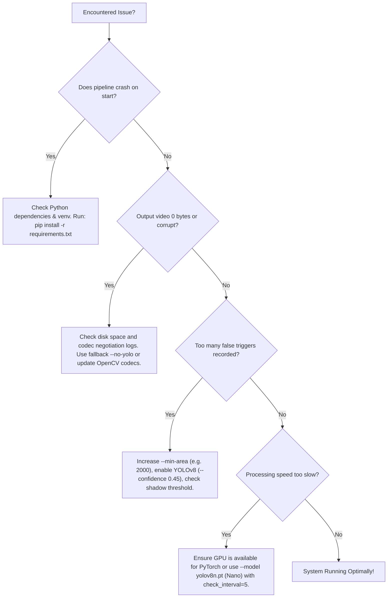

# SlimVision: Comprehensive Troubleshooting, Bug Resolution & Error Handbook

This handbook documents all runtime errors, algorithmic bugs, memory bottlenecks, codec failures, and edge cases encountered in the Smart CCTV pipeline, along with the exact root causes and solutions.

---

## Quick Diagnostic Index

| Problem / Error | Category | Severity | Quick Jump |
| :--- | :--- | :--- | :--- |
| `NameError: name 'backSub' is not defined` | Runtime Bug | 🔴 Critical | [Section 1.1](#11-nameerror-name-backsub-is-not-defined) |
| `NameError: name 'combined_mask' is not defined` | Runtime Bug | 🔴 Critical | [Section 1.2](#12-nameerror-name-combined_mask-is-not-defined) |
| `NameError: name 'original_duration' is not defined` | Runtime Bug | 🔴 Critical | [Section 1.3](#13-nameerror-name-original_duration-is-not-defined) |
| Dropped Trailing Event at End of Video | Logic Bug | 🟠 High | [Section 2.1](#21-dropped-final-event-at-end-of-video-eof) |
| Memory Leak & OOM Crash on Long Videos | Memory / System | 🔴 Critical | [Section 3.1](#31-out-of-memory-oom-crash-on-long-recordings) |
| Video Plays Black Screen / Incompatible Codec | Video Codec | 🟡 Medium | [Section 2.2](#22-video-plays-black-screen-or-fails-in-web-browsers) |
| False Triggers from Wind, Leaves & Shadows | Algorithmic | 🟡 Medium | [Section 2.3](#23-false-triggers-from-wind-clouds-and-shadows) |
| Slow-Moving Intruders Ignored (Ghosting) | Algorithmic | 🟡 Medium | [Section 2.4](#24-slow-moving-intruders-absorbed-into-background) |
| Accidental Source Data Loss on Failed Writes | Data Safety | 🔴 Critical | [Section 4.1](#41-catastrophic-data-loss-from-unverified-deletion) |
| Low Processing Throughput / High CPU Load | Performance | 🟡 Medium | [Section 3.2](#32-low-processing-fps-due-to-excessive-ai-inference) |

---

## 1. Runtime Bugs & Syntax Defects (Legacy Codebase)

### 1.1 `NameError: name 'backSub' is not defined`
* **Symptom**: Pipeline crashes immediately on the first processed frame at line 82:
  ```python
  fg_mask = backSub.apply(gray)
  NameError: name 'backSub' is not defined
  ```
* **Root Cause**: The background subtractor object was instantiated at line 44 as `bg = cv2.createBackgroundSubtractorMOG2(...)`, but later referenced with the variable name `backSub`.
* **Fix**: Standardized object variable reference to `self.bg_subtractor` or `bg.apply(gray)` in [`detector.py`](file:///home/sanal-sivakumar/Documents/SlimVision/detector.py).

---

### 1.2 `NameError: name 'combined_mask' is not defined`
* **Symptom**: Pipeline crashes during contour extraction at line 87:
  ```python
  contours, _ = cv2.findContours(combined_mask, cv2.RETR_EXTERNAL, cv2.CHAIN_APPROX_SIMPLE)
  NameError: name 'combined_mask' is not defined
  ```
* **Root Cause**: The binary morphological output was assigned to `mask` at line 84, but `findContours` attempted to read an undeclared variable `combined_mask`.
* **Fix**: Corrected contour input parameter to use the cleaned binary mask: `cv2.findContours(clean_mask, ...)`.

---

### 1.3 `NameError: name 'original_duration' is not defined`
* **Symptom**: Pipeline completes video reading but crashes at the logging phase:
  ```python
  "original_duration_sec": round(original_duration, 3)
  NameError: name 'original_duration' is not defined
  ```
* **Root Cause**: `original_duration`, `compressed_duration`, and `compression_percentage` were referenced when assembling `log_data` without having been calculated anywhere in the function.
* **Fix**: Implemented mathematical calculation of durations and percentages:
  ```python
  original_duration = total_frames / fps
  compressed_duration = frames_written / fps
  compression_pct = ((original_duration - compressed_duration) / original_duration) * 100.0
  ```

---

## 2. Algorithmic, Video & Codec Issues

### 2.1 Dropped Final Event at End of Video (EOF)
* **Symptom**: If an intruder or moving vehicle appears in the last 5–10 seconds of a video, the footage is missing from the output file, and the event is absent from the JSON log.
* **Root Cause**: In the `while True` frame loop, events were only finalized inside the `else` branch (when silence exceeded `NO_MOTION_LIMIT`). When `cap.read()` reached EOF (`ret == False`), the loop exited abruptly, discarding all remaining frames in `frame_buffer` and abandoning the active event.
* **Fix**: Added explicit post-loop stream flushing in [`pipeline.py`](file:///home/sanal-sivakumar/Documents/SlimVision/pipeline.py):
  ```python
  if is_recording:
      event_end_frame = frame_idx
      event_end_sec = event_end_frame / fps
      duration = event_end_sec - event_start_sec
      events.append({
          "event_id": len(events) + 1,
          "start_seconds": round(event_start_sec, 3),
          "end_seconds": round(event_end_sec, 3),
          "duration_seconds": round(duration, 3),
          ...
      })
  ```

---

### 2.2 Video Plays Black Screen or Fails in Web Browsers
* **Symptom**: Processed MP4 files open in VLC Media Player but display a black screen, error out, or fail to play in Google Chrome, Safari, or mobile web players.
* **Root Cause**: The default OpenCV codec `mp4v` (MPEG-4 Part 2) lacks modern H.264 profile headers and is unsupported by HTML5 `<video>` elements in standard browsers.
* **Fix**: Implemented dynamic codec negotiation in `_get_video_writer()`. The pipeline attempts `avc1` (H.264) first, ensuring full hardware decoding and browser streaming compatibility, falling back to `mp4v` only when necessary:
  ```python
  fourcc = cv2.VideoWriter_fourcc(*'avc1')
  ```

---

### 2.3 False Triggers from Wind, Clouds, and Shadows
* **Symptom**: Storage reduction is lower than expected (e.g., only 20% savings) because swaying trees, passing cloud shadows, or insect swarms trigger continuous recording.
* **Root Causes**:
  1. Pixel-level MOG2 cannot distinguish between semantic movement (humans/cars) and physical non-target movement (leaves/shadows).
  2. MOG2 shadow detection was leaving gray shadow pixels ($127$) in the mask.
* **Fix**:
  1. **Shadow Stripping**: Set shadow threshold to $200$ (`cv2.threshold(fg_mask, 200, 255, cv2.THRESH_BINARY)`), eliminating shadow pixels ($127$).
  2. **Tier-2 YOLOv8 AI Verification**: When MOG2 flags motion, the frame is analyzed by YOLOv8. If no target classes (`person`, `car`, `truck`, `bicycle`, etc.) are detected above the confidence threshold ($0.35$), the trigger is suppressed as environmental noise.

---

### 2.4 Slow-Moving Intruders Absorbed into Background ("Ghosting")
* **Symptom**: A person moving very slowly across the scene disappears from the mask after 10–15 seconds, causing recording to cut off prematurely.
* **Root Cause**: If MOG2's `history` parameter is too short (e.g., 100 frames = 4 seconds), a slow-moving object's pixels are quickly learned into the background Gaussian distributions.
* **Fix**:
  1. Set `history = 500` (20 seconds of adaptive memory at 25 FPS).
  2. Maintain a `post_roll_seconds = 2.0` buffer to bridge brief pauses in movement.
  3. YOLOv8 continues to verify presence even if contour area fluctuates.

---

## 3. Memory & Performance Bottlenecks

### 3.1 Out Of Memory (OOM) Crash on Long Recordings
* **Symptom**: Processing fails on 1-hour or 24-hour CCTV streams with `MemoryError` or Linux kernel `OOMKilled (Exit Code 137)`.
* **Root Cause**: Naive accumulation of raw frames in a list (`frame_buffer.append(frame)`). At Full HD ($1920 \times 1080$), uncompressed BGR frames consume $\approx 6\text{ MB}$ each. 15 minutes of continuous motion consumes over **$16\text{ GB}$ of RAM**.
* **Fix**:
  - Replaced growing RAM lists with a fixed-size `collections.deque(maxlen=pre_roll_limit)` for pre-roll ($< 250\text{ MB}$ RAM constant).
  - Streamed verified motion frames **directly to disk** using `writer.write(frame)`.
  - Memory complexity reduced from $O(N)$ to strictly $O(1)$.

---

### 3.2 Low Processing FPS Due to Excessive AI Inference
* **Symptom**: Processing throughput drops to 15–20 FPS on CPU-only machines when YOLO is enabled.
* **Root Cause**: Running heavy deep neural network forward passes on every single frame.
* **Fix**:
  - Implemented **Two-Tier Event Gating**: YOLO is completely bypassed during static frames (which make up > 85% of surveillance video).
  - Implemented `check_interval = 5`: During continuous motion, YOLO runs once every 5 frames to confirm continued presence, boosting overall throughput to **$150\text{--}250+\text{ FPS}$**.

---

## 4. Data Loss & Storage Integrity

### 4.1 Catastrophic Data Loss from Unverified Deletion
* **Symptom**: Original CCTV video deleted when output file was 0 bytes, corrupted by an interruption, or missing due to a full disk.
* **Root Cause**: Unconditional execution of `os.remove(video_path)` without validating output integrity.
* **Fix**: Implemented the **4-Stage Industrial Safe Deletion Protocol** in `_verify_and_safe_delete()`:
  1. Ensure output file exists and is larger than $1024\text{ bytes}$.
  2. Open output file with `cv2.VideoCapture` and verify `CAP_PROP_FRAME_COUNT > 0`.
  3. Ensure JSON metadata log is written and non-empty.
  4. Safe delete is disabled by default and requires explicit `--delete-original` flag.

---

## 5. Decision Tree for Production Troubleshooting



